# Research Paper Diagrams

This file contains paper-friendly architecture diagrams for the hate-speech detection project.

Recommended usage:

- Preview directly in any Markdown editor that supports Mermaid.
- Export each Mermaid block to `SVG` or `PDF` for the paper.
- Include the exported figure in LaTeX using `\includegraphics`.

---

## 1. Agentic RAG Model - Current Auto-Loop Architecture

**Suggested figure title:** Agentic RAG architecture with reflection, HITL, and self-improving memory

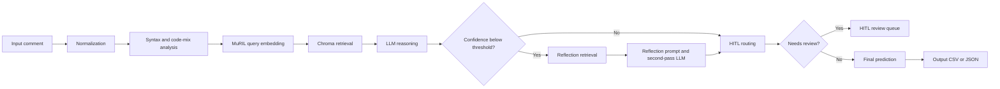

---

## 2. Previous Architecture - Before Auto-Loop

**Suggested figure title:** Baseline agentic RAG pipeline before reflection and auto-evaluation

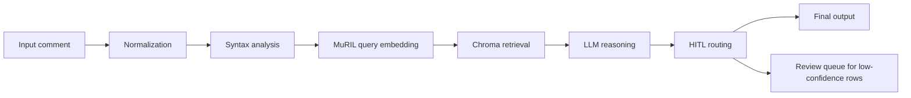

---

## 3. Auto-Loop Evaluation System

**Suggested figure title:** Auto-loop evaluation and self-improvement workflow

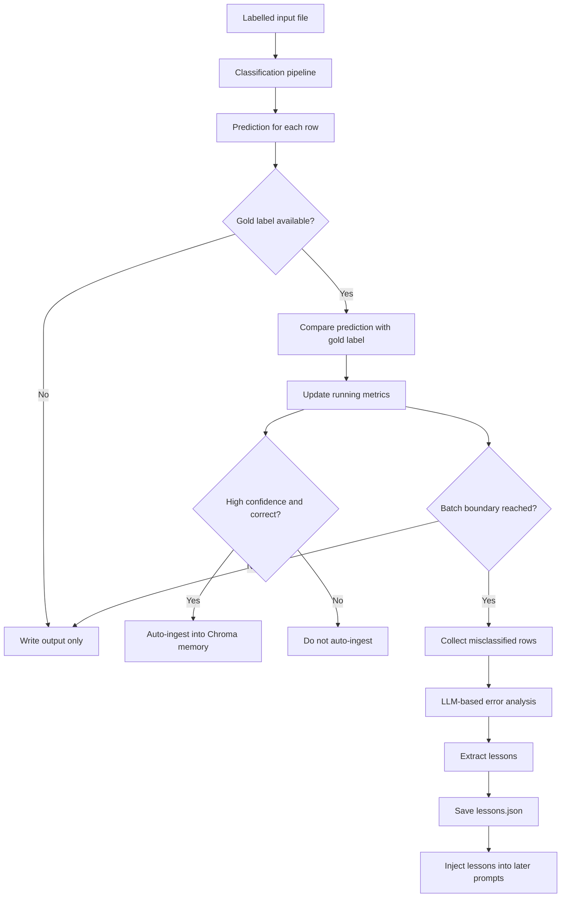

---

## 4. Ingestion Pipeline

**Suggested figure title:** Labelled data ingestion into RAG memory

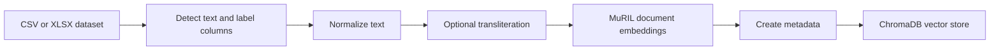

---

## 5. Embedding-Only Pipeline

**Suggested figure title:** Standalone embedding generation workflow

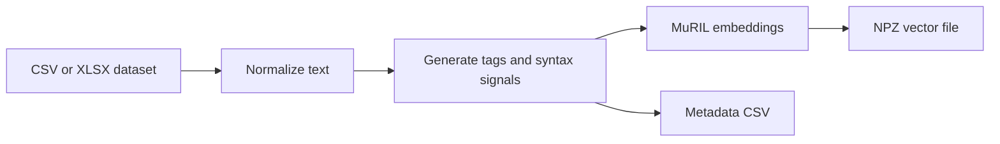

---

## 6. Classification Pipeline - Paper Summary View

**Suggested figure title:** End-to-end classification workflow


---

## 7. Internal LangGraph Node Flow

**Suggested figure title:** LangGraph node execution order

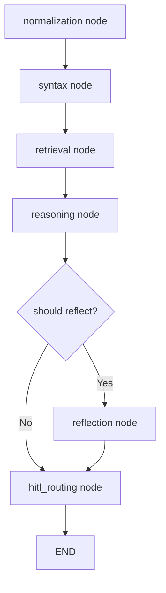

---

## 8. Reflection Subsystem

**Suggested figure title:** Reflection loop for low-confidence predictions

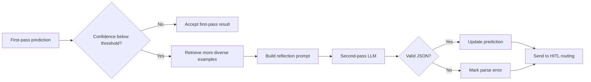

---

## 9. Retrieval Memory Subsystem

**Suggested figure title:** Retrieval memory design with MuRIL and ChromaDB

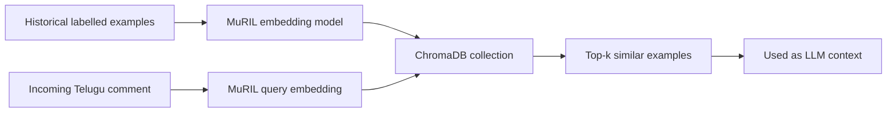

---

## 10. HITL Feedback Loop

**Suggested figure title:** Human-in-the-loop improvement cycle

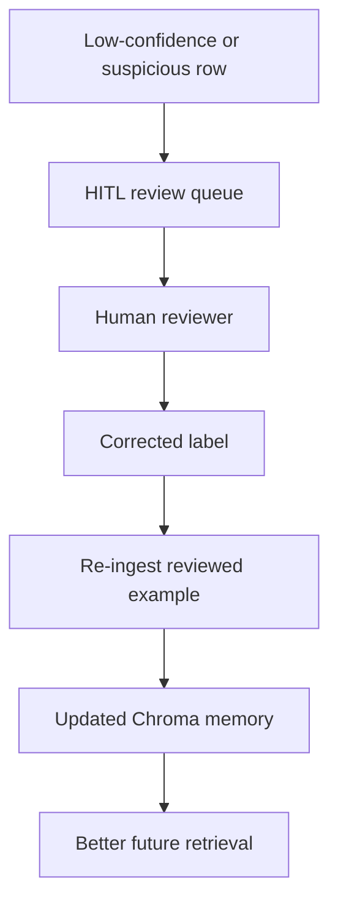

---

## 11. Auto-Ingest Feedback Loop

**Suggested figure title:** Verified prediction feedback into long-term memory

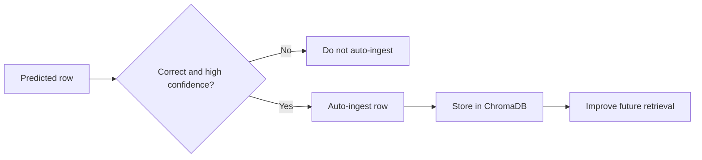

---

## 12. Deployment Options

**Suggested figure title:** Flexible deployment paths for the reasoning backend

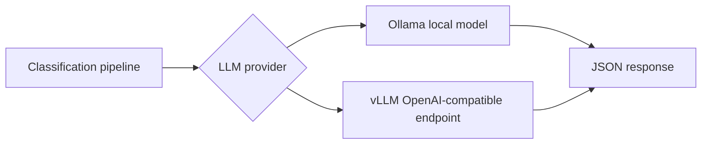

---

## 13. Output Artifact Map

**Suggested figure title:** Output files generated by the system

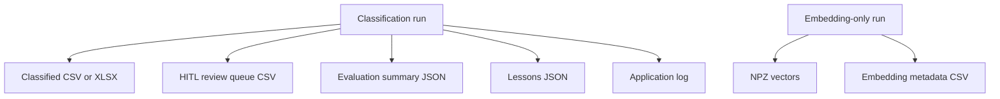

---

## 14. Baseline vs Auto-Loop Comparison

**Suggested figure title:** Architectural difference between baseline and auto-loop systems

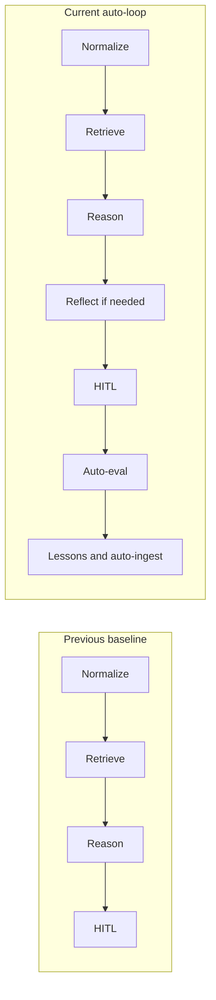

---

## Mermaid Source Export Commands

If you want publication-ready `SVG` or `PDF`, export the Mermaid diagrams first.

### Option 1: Mermaid CLI

Install once:

```powershell
npm install -g @mermaid-js/mermaid-cli
```

Export a diagram from a `.mmd` file:

```powershell
mmdc -i .\agentic_rag_model.mmd -o .\agentic_rag_model.svg -t neutral -b transparent
mmdc -i .\agentic_rag_model.mmd -o .\agentic_rag_model.pdf -t neutral -b white
```

### Option 2: Using `npx` without global install

```powershell
npx @mermaid-js/mermaid-cli -i .\agentic_rag_model.mmd -o .\agentic_rag_model.svg -t neutral -b transparent
```

### Recommended export settings for papers

```powershell
mmdc -i .\auto_loop_eval_system.mmd -o .\auto_loop_eval_system.pdf -t neutral -b white -w 2200
```

Notes:

- Use `-t neutral` for clean academic styling.
- Use `SVG` when the publisher accepts vector figures.
- Use `PDF` if your LaTeX workflow handles PDF figures more easily.

---

## LaTeX Figure Code for Research Papers

### Standard PDF include

```latex
\usepackage{graphicx}

\begin{figure}[t]
    \centering
    \includegraphics[width=\columnwidth]{figures/agentic_rag_model.pdf}
    \caption{Agentic RAG architecture with reflection, HITL, and self-improving memory.}
    \label{fig:agentic-rag-model}
\end{figure}
```

### SVG include if your paper setup supports it

```latex
\usepackage{svg}

\begin{figure}[t]
    \centering
    \includesvg[width=\columnwidth]{figures/agentic_rag_model}
    \caption{Agentic RAG architecture with reflection, HITL, and self-improving memory.}
    \label{fig:agentic-rag-model}
\end{figure}
```

### Two small diagrams side by side

```latex
\usepackage{graphicx}
\usepackage{subcaption}

\begin{figure}[t]
    \centering
    \begin{subfigure}[t]{0.48\columnwidth}
        \centering
        \includegraphics[width=\linewidth]{figures/previous_architecture.pdf}
        \caption{Previous baseline architecture.}
    \end{subfigure}
    \hfill
    \begin{subfigure}[t]{0.48\columnwidth}
        \centering
        \includegraphics[width=\linewidth]{figures/auto_loop_eval_system.pdf}
        \caption{Auto-loop evaluation system.}
    \end{subfigure}
    \caption{Comparison between the baseline pipeline and the current self-improving architecture.}
    \label{fig:baseline-vs-autoloop}
\end{figure}
```

---

## Suggested Figure Names for the Paper

- `agentic_rag_model`
- `previous_architecture`
- `auto_loop_eval_system`
- `ingestion_pipeline`
- `embedding_only_pipeline`
- `classification_pipeline`
- `langgraph_node_flow`
- `reflection_subsystem`
- `retrieval_memory_subsystem`
- `hitl_feedback_loop`
- `auto_ingest_feedback_loop`
- `deployment_options`
- `output_artifact_map`
- `baseline_vs_autoloop`

---

## Practical Workflow

1. Copy one Mermaid diagram block into a `.mmd` file.
2. Export it using `mmdc`.
3. Save the exported figure in your paper's `figures/` folder.
4. Insert it in LaTeX using `\includegraphics`.
5. Use the suggested captions from this file and adjust wording if needed.
